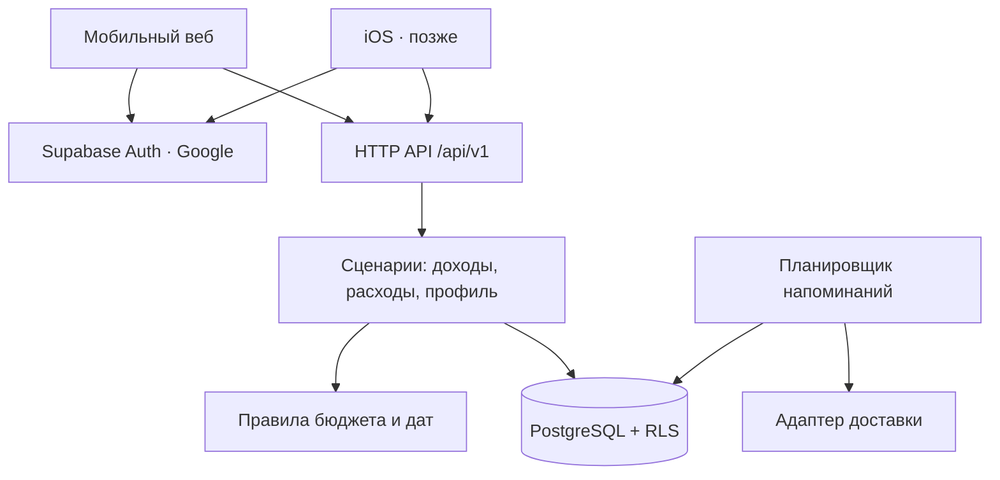

# FINN — архитектура

Статус: проект архитектуры, 13 сентября 2026. Код приложения и облачная инфраструктура ещё не созданы.

## Продукт и границы первой версии

Мобильный веб, тёмная тема, базовый дизайн 402 × 900 px. В приложении ширина адаптивная: 402 px — размер макета, а не ограничение для телефона; высота контента не фиксирована. Учитываем safe area и экранную клавиатуру. Десктопный интерфейс — позже.

Пользователь добавляет доход отдельными поступлениями с датой и суммой. Планирует расходы, видит их месячную сумму и доступный остаток. Регулярному расходу задаёт день оплаты и напоминание.

Личный кабинет: профиль, валюта, часовой пояс, настройки напоминаний, выход, экспорт и удаление своих данных. Вход через Google. Нативный iOS-клиент будет использовать ту же учётную запись и данные.

Рабочие допущения, которые можно изменить: доход только полученный; одна валюта RUB на бюджет; месяцы независимы, без автоматического переноса остатка; один личный бюджет на пользователя. Учёт фактических оплат предлагаем добавить отдельно от плана. Google пока означает вход, а не доступ к календарю или почте.

## Основное решение

Модульное приложение с одним API и PostgreSQL. Без отдельных микросервисов на старте.

| Часть | Выбор | Назначение |
| --- | --- | --- |
| Веб | Next.js, React, TypeScript | Мобильный интерфейс и серверные HTTP-обработчики |
| UI | CSS variables, CSS Modules | Тёмная тема, единые токены, компоненты форм и списков |
| Домен | Чистый TypeScript | Расчёты бюджета, даты регулярных платежей, проверки |
| Контракты | Zod + документированный REST `/api/v1` | Валидация входных данных и единый контракт клиентов |
| Данные | Supabase PostgreSQL | Доходы, расходы, профиль, миграции SQL |
| Авторизация | Supabase Auth + Google | Управление пользователями и сессиями |
| Напоминания | Планировщик + таблица заданий в PostgreSQL | Выполнение без открытого приложения, повторы доставки |
| iOS, позже | SwiftUI или React Native / Expo | Выбор позже; общий API обязателен, общий UI не предполагается |

Supabase выбран как управляемый PostgreSQL и провайдер авторизации. Домен не зависит от его SDK. Привязка к поставщику остаётся в адаптерах данных и авторизации. Платформу размещения веба и тариф выбираем при внедрении по доступности, региону данных и бюджету. Версии зависимостей фиксируем в lockfile при создании приложения.



## Структура репозитория при реализации

```text
apps/web/
  src/app/                 страницы, auth callback, API routes
  src/features/            budget, income, expenses, profile
  src/components/          общие элементы мобильного интерфейса
  src/server/              сценарии, репозитории, проверка сессии
  src/styles/              токены темы и базовые стили
packages/domain/           деньги, месяцы, регулярность, чистые функции
packages/contracts/        DTO, схемы валидации, коды ошибок
supabase/migrations/       схема, индексы, RLS
jobs/                      обработчик регулярности и напоминаний
 docs/                     продуктовые и архитектурные решения
```

Все HTTP-обработчики тонкие: проверка сессии → валидация → сценарий → результат. Компоненты не выполняют SQL и не содержат финансовых расчётов. Server Actions не становятся единственным интерфейсом бизнес-операций: iOS должен обращаться к HTTP API. Отдельное мобильное приложение добавляем только при начале iOS-разработки.

## Модель данных

Все бизнес-таблицы имеют UUID, `owner_id`, `created_at`, `updated_at`; изменяемые записи — `version` для защиты от потери параллельных изменений. `owner_id` определяется из проверенной сессии, а не из тела запроса. Связанные сущности проверяются на принадлежность одному пользователю.

| Сущность | Основные поля и смысл |
| --- | --- |
| `profiles` | `id = auth.users.id`, имя, аватар, IANA timezone, locale; учётные данные хранит Auth |
| `budgets` | `owner_id UNIQUE`, currency; один бюджет на старте |
| `budget_months` | budget_id, month_date (первое число), opening_balance_minor = 0; UNIQUE(budget_id, month_date) |
| `income_entries` | month_id, amount_minor, received_on, title, note |
| `expense_templates` | budget_id, title, amount_minor, day_of_month (1–31), active_from, active_until, reminder_days_before |
| `planned_expenses` | month_id, template_id nullable, title, planned_amount_minor, due_on nullable, reminder_days_before nullable, cancelled_at |
| `expense_payments` | planned_expense_id, amount_minor, paid_on; фактические оплаты, включая частичные |
| `notification_preferences` | owner_id, канал, enabled, local_delivery_time |
| `reminder_jobs` | planned_expense_id, scheduled_at, status, attempts, next_attempt_at, dedupe_key UNIQUE |
| `idempotency_keys` | owner_id, key, request_hash, result, expires_at; UNIQUE(owner_id, key) |

Суммы — целое количество копеек, никогда float. PostgreSQL bigint; на API суммы передаются десятичной строкой, чтобы не терять точность JSON/JavaScript. Домен использует bigint. Валюта — ISO 4217; смешение валют в одном бюджете запрещено. Изменение валюты существующего бюджета с записями не допускаем без отдельного сценария миграции.

Финансовые даты — `date`, технические timestamps — UTC `timestamptz`. Месяц определяется календарной датой операции. При переносе дохода на другую дату сервер обновляет month_id согласованно. Плановый расход может быть оплачен в другом месяце; план остаётся в своём месяце, фактический платёж имеет собственную дату.

## Расчёты и регулярность

- Доход месяца = сумма поступлений этого месяца.
- План расходов = сумма неотменённых плановых строк месяца.
- Свободно после плана = начальный остаток + доход − план расходов. Может быть отрицательным.
- Оплата плановой строки не уменьшает свободный остаток повторно. Это показатель планирования, а не баланс банковского счёта.
- Оплачено по строке = сумма её платежей; осталось оплатить = max(план − оплачено, 0). Переплату показываем отдельно.
- Статусы «не оплачено», «частично», «оплачено» выводятся из платежей. При прошедшей дате и неоплаченном остатке показываем «проверь оплату».
- Не храним вычисляемые месячные суммы как источник истины.

Шаблон создаёт отдельную плановую строку для каждого месяца. Для 29–31-го числа используем последний доступный день короткого месяца. Уникальность `(template_id, month_id)` для регулярных строк предотвращает дубли. Генерация идемпотентна: при открытии месяца и фоновым заданием, минимум на текущий и следующий месяц.

Плановая строка хранит снимок названия, суммы и даты. Редактирование шаблона применяется к будущим ещё не созданным строкам; изменение уже созданных будущих строк — отдельный явный сценарий. История не переписывается. Отмена строки не удаляет шаблон.

Часовой пояс профиля определяет локальное время напоминания. После изменения даты, оплаты или отмены строки задания пересчитываются/отменяются; перед доставкой исполнитель повторно проверяет актуальность. Для повторов используются блокировка задания, ограничение попыток и dedupe_key. Если провайдер не поддерживает идемпотентность, абсолютную гарантию единственной доставки не обещаем.

В первой версии достаточно списка ближайших оплат внутри приложения. Внешний канал (web push, email, календарь) выбираем отдельно. Напоминание не зависит от browser setTimeout и открытой вкладки.

## Авторизация и доступ к данным

1. Пользователь нажимает «Продолжить с Google».
2. Supabase Auth выполняет OAuth-поток; веб callback обменивает код на сессию через поддерживаемый SSR/PKCE-механизм.
3. Разрешённые redirect URL задаются точно для production и отдельно для разработки; пользовательский произвольный redirect не принимается.
4. Профиль и бюджет создаются идемпотентно. Внутренний идентификатор — Auth user UUID; email не служит ключом владения.
5. Веб использует поддерживаемую cookie-сессию. API проверяет подлинность и срок действия сессии/токена на каждом запросе. Cookie-аутентифицированные мутации имеют проверку Origin/CSRF; cookie-настройки соответствуют используемому SSR SDK.
6. Будущий iOS передаёт проверяемый Bearer access token. Refresh token хранится в защищённом хранилище ОС. OAuth callback — через настроенную мобильную ссылку.

Во всех пользовательских таблицах включён RLS: SELECT/UPDATE/DELETE только при `auth.uid() = owner_id`, INSERT/UPDATE с соответствующим WITH CHECK. При обращении из API к БД передаём сессию пользователя, чтобы RLS действовал и за сервером. Service role не используется для обычного пользовательского CRUD; доступен только выделенным административным/фоновым операциям на сервере. Secret/service-role ключи отсутствуют в клиентской сборке.

Проверяем владение также через ограничения связанных записей или транзакционные проверки, чтобы нельзя было привязать свою оплату к чужому расходу. Запрос чужого объекта возвращает 404. В журналах не записываем токены и содержимое финансовых записей.

Выход отзывает доступную сессию и очищает клиентский кэш. Экспорт и удаление аккаунта — серверные сценарии; удаление включает записи бюджета и задания напоминаний, затем Auth-пользователя. Срок жизни резервных копий отдельно описываем перед запуском.

## Google и iOS

Для входа запрашиваем только идентификационные scopes, без Calendar/Gmail. Если потребуется Google Calendar, добавляем отдельное подключение с согласием пользователя, минимальными scopes, защищённым хранением refresh token на сервере и возможностью отключения. Учётная запись FINN продолжает существовать независимо от Calendar.

Схема авторизации допускает дополнительные identity providers. Для iOS предусматриваем Sign in with Apple: правило App Store 4.8 для стороннего входа требует эквивалентный вариант входа с указанными Apple характеристиками, с оговорёнными исключениями. Применимость проверяем перед публикацией. Не связываем аккаунты автоматически только по совпадению email.

## Контракт API

Все операции требуют пользователя, кроме auth-потока и технического health endpoint.

| Метод / маршрут | Назначение |
| --- | --- |
| GET /api/v1/me | Профиль и настройки |
| PATCH /api/v1/me | Настройки профиля |
| GET /api/v1/months/YYYY-MM | Сводка, доходы, расходы и оплаты месяца |
| POST /api/v1/incomes | Добавить поступление |
| PATCH / DELETE /api/v1/incomes/:id | Изменить / удалить поступление |
| POST /api/v1/expenses | Создать плановый расход |
| PATCH /api/v1/expenses/:id | Изменить или отменить строку |
| POST /api/v1/expenses/:id/payments | Зарегистрировать оплату |
| PATCH / DELETE /api/v1/payments/:id | Исправить / удалить оплату |
| GET / POST /api/v1/recurring-expenses | Список / создание шаблонов |
| PATCH /api/v1/recurring-expenses/:id | Изменение или остановка шаблона |
| GET /api/v1/me/export | Экспорт данных |
| DELETE /api/v1/me | Удаление аккаунта после повторного подтверждения личности |

Создающие мутации принимают Idempotency-Key: повтор с тем же телом возвращает первоначальный результат, с другим — конфликт. Результат и запись ключа сохраняются атомарно. Изменения проверяют version, при устаревшей версии — 409. Общий формат ошибки: `{code, message, fieldErrors?, requestId}`. Многострочные финансовые изменения выполняются транзакционно.

## Этапы и проверка

1. Мобильный прототип: экран месяца, формы, доходы/план, ближайшие даты. Только демонстрационные данные; UI работает через адаптер с будущим контрактом API. Реальные данные не оставляем исключительно в памяти или localStorage.
2. Хранение и кабинет: миграции, RLS, Google Auth, пользовательский API, настройки, экспорт/удаление. Данные доступны после повторного входа и с другого устройства.
3. Регулярность: шаблоны, месячные экземпляры, оплаты, задания и выбранный канал напоминаний.
4. iOS: тот же API, mobile auth callback, при необходимости Apple; desktop UI развивается отдельно.

Перед работой с реальными данными обязательны тесты денежных расчётов, повторного POST, конфликтов обновления, доступа пользователя A к данным B и сквозной сценарий вход → доход → расход → выход → повторный вход. Для регулярности — февраль, високосный год, 31-е число, смена timezone, оплата перед доставкой и повтор задания. Для UI — 402 × 900, узкий телефон, клавиатура и safe area.

## Первичные источники

Проверены при подготовке проекта архитектуры; детали интеграций уточняются по документации при реализации.

- [Supabase Auth](https://supabase.com/docs/guides/auth)
- [Вход через Google](https://supabase.com/docs/guides/auth/social-login/auth-google)
- [Server-side Auth](https://supabase.com/docs/guides/auth/server-side)
- [Redirect URLs](https://supabase.com/docs/guides/auth/redirect-urls)
- [Мобильные auth callbacks](https://supabase.com/docs/guides/auth/native-mobile-deep-linking)
- [Sign in with Apple](https://supabase.com/docs/guides/auth/social-login/auth-apple)
- [App Store Review Guidelines, 4.8](https://developer.apple.com/app-store/review/guidelines/#login-services)
